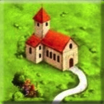
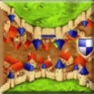
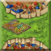
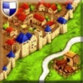
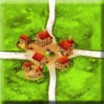

## Alpha0 agent

All credits to this implementation go for the author of the following repo, from which I borrowed 99% of the code:

- https://github.com/suragnair/alpha-zero-general/

The code implements a self-play based algorithm based on the AlphaGo Zero paper. All the mistakes I introduced on the code are my own ;-).

An explanation on how the algorithm works from the repo author:

- http://web.stanford.edu/~surag/posts/alphazero.html

The original alpha go 0 paper can be found at:

- https://www.nature.com/articles/nature24270

For the first iteration I wanted to simplify the problem, so I can get better intuitions 
on how/whether the algorithm is working. To begin with, the action space is huge, as the board
can potentially get very large. Each action also encodes the location, the rotation and the
meeple placement.

For this reason, I reduced the space reducing the number of tiles to:

    TODO >>

    tile_counts = {
        "A": 1, "B": 1, "C": 1, "D": 1, "E": 1, "F": 1, "G": 1, "H": 1,
        "I": 1, "J": 1, "K": 1, "L": 1, "M": 1, "N": 1, "O": 1, "P": 1,
        "Q": 1, "R": 1, "S": 1, "T": 1, "U": 1, "V": 1, "W": 1, "X": 1
    }

With the reduced tile count, I also assumed a 12x12 board size. This is not correct, as in some
circumstances the effective board could outgrow this window, but it will serve for now. I just
removed all the examples that could outgrow the board.

The next step is to decide how to encode the board state and pass it to the neural network. This is
where I have more doubts as an ML newbie. I decided to go for a 12x12xN_Channels, where each
channel is a feature of the tile.

Each tile can have many placements (road, city, field, monastery):

The number of possible meeple placements for each tile and its connectivity also varies from tile to tile.

For each of the 12x12 positions of the board I only encode the following features:
 - The type of tile
 - An array of possible meeple placements of 4x4 (4 type of placements, and 4max placements of each type per tile). The values of which are 1, -1, 0.

In this initial version I don't encode anything else (connectivity of each placement), borders, city shields, etc.

I adapted the existing carcassone engine code to produce the functions that alpha-zero-general was expecting (getCanonicalForm, getSymmetries, etc). However
some of them are very innefficient.

   
Besides the 12x12 positions, I add an array with current scores, and the meeple count of each
player.

For the neural network I use one very similar to alpha-zero-general / othello. 

Results:

